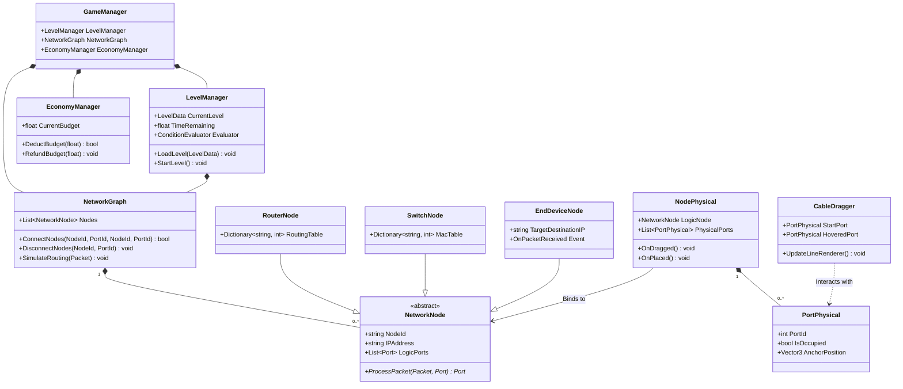
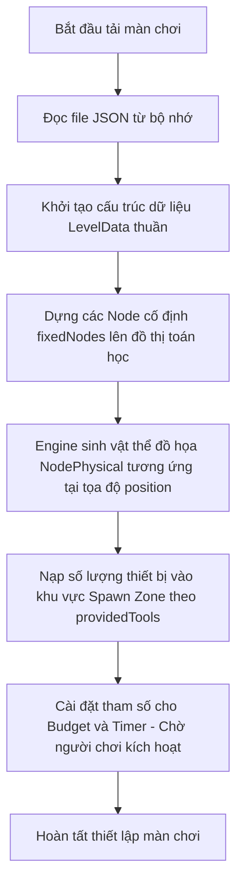

# TÀI LIỆU THIẾT KẾ KỸ THUẬT (TECHNICAL DESIGN DOCUMENT - TDD)

**Dự án:** Co-op Network Puzzle Simulation Game

**Vai trò:** Software Architect & Lead Game Designer

**Công cụ phát triển tích hợp:** Unity Engine (C#)

# 1. Cấu Trúc Class (Class Architecture)

Hệ thống được thiết kế theo kiến trúc phân lớp tách biệt giữa dữ liệu logic (Model), xử lý tương tác đồ họa (View/Controller) và quản lý luồng game (Manager) nhằm đảm bảo tính độc lập và khả năng mở rộng hệ thống.



## 1.1. Lớp Quản lý & Logic Hệ thống (Managers & Core Logic)

### `GameManager` (Singleton)

- **Nhiệm vụ:** Đóng vai trò là trung tâm điều phối phối hợp (Orchestrator) toàn cục của trò chơi, quản lý vòng đời khởi tạo và thiết lập các kết nối giữa các phân hệ quản lý độc lập.
- **Thuộc tính:**
    - `LevelManager`: Tham chiếu đến bộ quản lý màn chơi.
    - `NetworkGraph`: Tham chiếu đến bộ xử lý đồ thị mạng lõi hiện tại.
    - `EconomyManager`: Tham chiếu đến bộ quản lý ngân sách toàn cục.

### `LevelManager`

- **Nhiệm vụ:** Quản lý vòng lặp trạng thái của màn chơi bao gồm việc đọc cấu hình, đếm ngược thời gian, và kích hoạt trạng thái thắng/thua.
- **Thuộc tính:**
    - `CurrentLevel`: Dữ liệu của màn chơi hiện tại (`LevelData`).
    - `TimeRemaining`: Thời gian còn lại của màn chơi (giây).
    - `IsLevelActive`: Cờ trạng thái xác định game đang chạy hay đang ở màn hình chờ/briefing.
- **Phương thức:**
    - `LoadLevel(LevelData data)`: Nhận dữ liệu giải đố thô, ra lệnh cho `NetworkGraph` dựng các Node cố định.
    - `StartLevel()`: Bắt đầu kích hoạt đồng hồ đếm ngược khi người chơi xác nhận hiểu rõ nhiệm vụ.
    - `UpdateTimer(float deltaTime)`: Khấu trừ thời gian thực và kích hoạt sự kiện thất bại khi thời gian về 0.

### `EconomyManager`

- **Nhiệm vụ:** Ràng buộc các quyết định xây dựng hạ tầng của người chơi trong phạm vi ngân sách cho phép của màn chơi.
- **Thuộc tính:**
    - `CurrentBudget`: Số tiền khả dụng hiện tại của người chơi trong màn.
- **Phương thức:**
    - `DeductBudget(float amount)`: Trừ tiền khi người chơi mua thêm vật tư tiêu hao (như dây thừng). Trả về `false` nếu không đủ số dư.
    - `RefundBudget(float amount)`: Hoàn trả lại tiền khi người chơi thu hồi/dỡ dây thừng trước khi vận hành mạng lưới.

### `NetworkGraph`

- **Nhiệm vụ:** Quản lý cấu trúc liên kết mạng (Topology) dưới dạng mô hình toán học đồ thị tĩnh (Graph), bao gồm các Đỉnh (Node) và Cạnh (Edge).
- **Thuộc tính:**
    - `Nodes`: Danh sách tất cả các đối tượng `NetworkNode` đang tham gia vào mạng lưới đồ thị.
- **Phương thức:**
    - `ConnectNodes(string nodeA, int portA, string nodeB, int portB, float length)`: Tạo một liên kết logic (Edge) hai chiều giữa hai cổng cụ thể của hai thiết bị mạng.
    - `DisconnectNodes(string nodeId, int portId)`: Bẻ gãy mối liên kết logic tại cổng chỉ định và giải phóng cổng.
    - `SimulateRouting(Packet packet)`: Chạy thuật toán duyệt đồ thị thời gian thực để đưa gói tin đi qua các node dựa trên quy tắc logic của từng thiết bị.

### 1.2. Lớp Dữ liệu Thiết bị Mạng (Network Node Models)

### `NetworkNode` (Abstract Base Class)

- **Nhiệm vụ:** Định nghĩa bộ khung dữ liệu logic chuẩn cho mọi loại thiết bị phần cứng xuất hiện trong trò chơi.
- **Thuộc tính:**
    - `NodeId`: Định danh duy nhất (UUID) của thiết bị.
    - `IPAddress`: Địa chỉ IP logic được cấu hình bởi người chơi (hoặc mặc định).
    - `LogicPorts`: Danh sách các đối tượng cổng logic (`Port`) gắn liền với thiết bị.
- **Phương thức:**
    - `ProcessPacket(Packet packet, Port incomingPort)`: Hàm thuần ảo (Pure Virtual). Mỗi thiết bị kế thừa bắt buộc phải override để định nghĩa thuật toán định tuyến gói tin cụ thể của mình.

### `RouterNode` (Kế thừa từ `NetworkNode`)

- **Nhiệm vụ:** Định tuyến gói tin dựa trên địa chỉ IP đích ở Lớp 3 (Network Layer).
- **Thuộc tính:**
    - `RoutingTable`: Bảng định tuyến dạng Key-Value (`Dictionary<string, int>`) ánh xạ giữa `DestinationIP` và `PortId` đầu ra.

### `SwitchNode` (Kế thừa từ `NetworkNode`)

- **Nhiệm vụ:** Chuyển mạch gói tin ở Lớp 2 (Data Link Layer) dựa trên cơ chế học địa chỉ.
- **Thuộc tính:**
    - `MacAddressTable`: Bảng ánh xạ giữa `SourceIP` của gói tin và `PortId` vật lý tương ứng nhận vào để tối ưu hóa đường truyền cục bộ.

### `EndDeviceNode` (Kế thừa từ `NetworkNode` - Đại diện cho các Ngôi làng đầu cuối)

- **Nhiệm vụ:** Đóng vai trò là điểm đầu cuối gửi nhận nội dung bài toán (Nguồn và Đích).
- **Thuộc tính:**
    - `OnPacketReceivedSuccessfully`: Sự kiện (Event) kích hoạt khi nhận đúng gói tin đích với đầy đủ yêu cầu (ví dụ: đã kiểm tra mã hóa).

### 1.3. Lớp Biểu diễn & Tương tác Vật lý (Physics & Interaction Views)

### `NodePhysical`

- **Nhiệm vụ:** Thành phần chịu trách nhiệm quản lý va chạm vật lý, xử lý sự kiện kéo thả của người chơi trong không gian thế giới game và cập nhật biểu đồ tọa độ.
- **Thuộc tính:**
    - `LogicNode`: Tham chiếu đến đối tượng logic `NetworkNode` tương ứng.
    - `PhysicalPorts`: Danh sách các điểm neo vật lý (`PortPhysical`) nằm trên Model.
- **Phương thức:**
    - `OnDragged()`: Kích hoạt khi người chơi di chuyển thiết bị mạng, cập nhật liên tục tọa độ tạm thời để đồng bộ vị trí đồ họa.
    - `OnPlaced()`: Kích hoạt khi người chơi thả thiết bị xuống một vị trí cố định, thực hiện tính toán cập nhật dữ liệu vị trí lên Bản đồ nhỏ (Minimap).

### `PortPhysical`

- **Nhiệm vụ:** Biểu diễn vị trí không gian (Transform Anchor) của cổng cắm trên mô hình thiết bị 3D/2D.
- **Thuộc tính:**
    - `PortId`: Chỉ số cổng trùng khớp với cổng logic trong `NetworkNode`.
    - `IsOccupied`: Trạng thái cổng đã bị cắm dây thừng vào hay chưa.
    - `AnchorPosition`: Tọa độ Vector thế giới chính xác của cổng để làm tâm hút.

### `CableDragger`

- **Nhiệm vụ:** Quản lý trạng thái kéo, thả và kết nối của môi trường truyền dẫn (dây thừng/cáp).
- **Thuộc tính:**
    - `StartPort`: Cổng vật lý xuất phát của sợi dây.
    - `HoveredPort`: Cổng vật lý hiện tại mà đầu dây tự do đang lơ lửng tiếp cận (nếu có).

# 2. Thiết Kế Dữ Liệu Màn Chơi Theo Hướng Data-Driven (Data-Driven Level Design)

Toàn bộ thông tin cấu trúc, ràng buộc cơ chế của một màn chơi đều được phân tách hoàn toàn khỏi mã nguồn của Engine, định hình thông qua cấu trúc dữ liệu tĩnh (JSON).

## 2.1. Template Dữ liệu Mẫu (Level Data JSON Template)

JSON

```json
{
  "levelId": "level_02_routing_challenge",
  "title": "Mạng Lưới Phù Thủy Cấp Cao",
  "description": "Làng A cần thiết lập kết nối bảo mật đến Làng B, ngăn chặn Thương nhân C đọc trộm thông tin thương mại đi ngang qua tuyến đường trung tâm.",
  "objectiveDescription": "Tạo mạng lưới liên thông dữ liệu hai chiều có tích hợp tính năng kiểm tra tính toàn vẹn và bảo mật thông tin.",
  "sourceVillageIP": "10.0.0.10",
  "destinationVillageIP": "10.0.0.20",
  "startingBudget": 1200.00,
  "timeLimitInSeconds": 300.0,
  "fixedNodes": [
    {
      "id": "node_village_a",
      "name": "Làng Thương Nhân A",
      "type": "EndDevice",
      "ipAddress": "10.0.0.10",
      "position": [0.0, 0.0, 10.0]
    },
    {
      "id": "node_village_b",
      "name": "Làng Thương Nhân B",
      "type": "EndDevice",
      "ipAddress": "10.0.0.20",
      "position": [200.0, 0.0, 85.0]
    }
  ],
  "providedTools": [
    {
      "type": "Router",
      "maxQuantity": 2
    },
    {
      "type": "Switch",
      "maxQuantity": 1
    }
  ]
}
```

### 2.2. Quy trình Đọc và Khởi tạo Màn chơi (Parsing & Instantiation Workflow)

Hệ thống tuân thủ nghiêm ngặt quy trình 3 bước tuần tự khi tải màn chơi nhằm triệt tiêu tối đa độ trễ logic và bất đồng bộ trạng thái:



1. **Giai đoạn Giải mã Dữ liệu (Deserialization):** Lớp `LevelManager` gọi bộ Parser của Engine để chuyển đổi chuỗi văn bản JSON thành một Object thuộc lớp `LevelData` trong bộ nhớ.
2. **Khởi tạo Thực thể Đồ thị (Logical Graph Instantiation):** Hệ thống duyệt qua danh sách `fixedNodes`. Với mỗi phần tử, hệ thống tạo đối tượng logic `EndDeviceNode` tương ứng, nạp các giá trị `ipAddress` và đưa vào trình quản lý `NetworkGraph`.
3. **Dựng Không gian Vật lý (Physical Spawning):** * Dựa trên mảng `position` $[X, Y, Z]$ của `fixedNodes`, Engine thực hiện Instantiate các Prefab đồ họa của ngôi làng ra thế giới game.
    - Hệ thống đọc mảng `providedTools` để thiết lập số lượng giới hạn phần cứng nằm trong "Khu vực cấp phát ban đầu" (Spawn Zone) , đồng thời nạp cấu hình `startingBudget` cho `EconomyManager`.

# 3. Cơ Chế Snapping Vật Lý (Physics Snapping Mechanics)

Cơ chế Snapping xử lý bài toán chuẩn hóa dữ liệu hình học, tự động kéo đầu nối của môi trường truyền dẫn vật lý (dây thừng) bám chặt vào tâm của các cổng mạng vật lý khi nằm trong một bán kính dung sai chỉ định.

## 3.1. Các Tham số Kỹ thuật Cấu hình (Configuration Parameters)

| **Tên tham số** | **Kiểu dữ liệu** | **Giá trị mặc định gợi ý** | **Mô tả chức năng kỹ thuật** |
| --- | --- | --- | --- |
| `SnapDistance` | `float` | `1.5f` (mét thế giới) | Bán kính hình cầu quét tìm kiếm quanh tâm của cổng cắm mạng. Nếu đầu cáp nằm trong vùng này, lực hút snapping sẽ được kích hoạt. |
| `MaxCableLength` | `float` | `100.0f` (mét thế giới) | Giới hạn chiều dài vật lý tối đa của một sợi cáp/dây thừng được kéo nối giữa hai thực thể phần cứng. |
| `DetectionLayerMask` | `LayerMask` | `Layer: NetworkPorts` | Bộ lọc va chạm vật lý, ép tia quét hoặc vùng quét chỉ tương tác với các Collider đại diện cho cổng, bỏ qua các va chạm địa hình. |

## 3.2. Thuật toán Xử lý Hình học và Kiểm tra Chiếm chỗ (Mathematical Algorithm)

### Bước 1: Quét tìm kiếm thực thể cổng lân cận (Proximity Query)

Khi người chơi đang trong trạng thái kéo một sợi dây cáp (`isDragging == true`), vị trí đầu cáp tự do ($P_{cable}$) liên tục di chuyển theo vị trí trỏ của chuột/tay nhân vật trên mặt phẳng 3D/2D. Hệ thống sử dụng một vùng quét hình cầu (Sphere Overlay/Cast) tại tọa độ đầu cáp để tìm kiếm cổng:

$$S = \{ \text{PortPhysical } p \mid \| P_{p} - P_{cable} \| \le \text{SnapDistance} \}$$

Trong đó, $P_{p}$ là tọa độ không gian ba chiều thế giới (`AnchorPosition`) của cổng vật lý $p$.

### Bước 2: Kiểm tra trạng thái chiếm chỗ và Dung lượng kết nối (Occupancy Check)

Nếu tập hợp $S$ tìm thấy nhiều hơn một cổng thỏa mãn, hệ thống sẽ tiến hành lọc và sắp xếp cổng có khoảng cách Euclidean ngắn nhất. Tuy nhiên, cổng được chọn ($p_{target}$) phải vượt qua các bộ lọc điều kiện logic nghiêm ngặt:

1. **Bộ lọc Trạng thái cắm (`IsOccupied`):** Kiểm tra xem cổng này đã có sợi dây nào kết nối trước đó chưa. Nếu `p_target.IsOccupied == true`, thuật toán lập tức từ chối snap và giữ nguyên đầu dây ở trạng thái tự do bám theo chuột để tránh xung đột kết nối.
2. **Bộ lọc Loại môi trường:** Đảm bảo loại cáp đang kéo tương thích với loại cổng vật lý (ví dụ: cáp đồng không thể cắm vào cổng quang, dây thừng loại nhẹ không cắm được vào cổng đại sảnh xa).

### Bước 3: Đưa về vị trí Snap và Chốt liên kết đồ thị (Snapping Implementation)

Khi cổng $p_{target}$ hợp lệ được xác định:

- **Xử lý đồ họa (Visual Snapping):** Tọa độ đầu dây cáp lập tức được gán cưỡng bức bằng tọa độ tâm của cổng:
    
    $$P_{cable} = P_{p\_target}$$
    
- **Xử lý Logic (Logical Binding):** Khi người chơi thực hiện hành động nhả chuột/thả nút xác nhận kết nối, hệ thống sẽ thực thi hàm chốt logic:
    1. Đánh dấu trạng thái cổng: `p_target.IsOccupied = true`.
    2. Tính toán khoảng cách thực tế giữa hai Node để lưu lại thông số chiều dài sợi dây phục vụ cho bài toán tính toán độ trễ và suy hao tín hiệu sau này.
    3. Gọi hàm `NetworkGraph.ConnectNodes(...)` để đồng bộ đồ thị toán học.