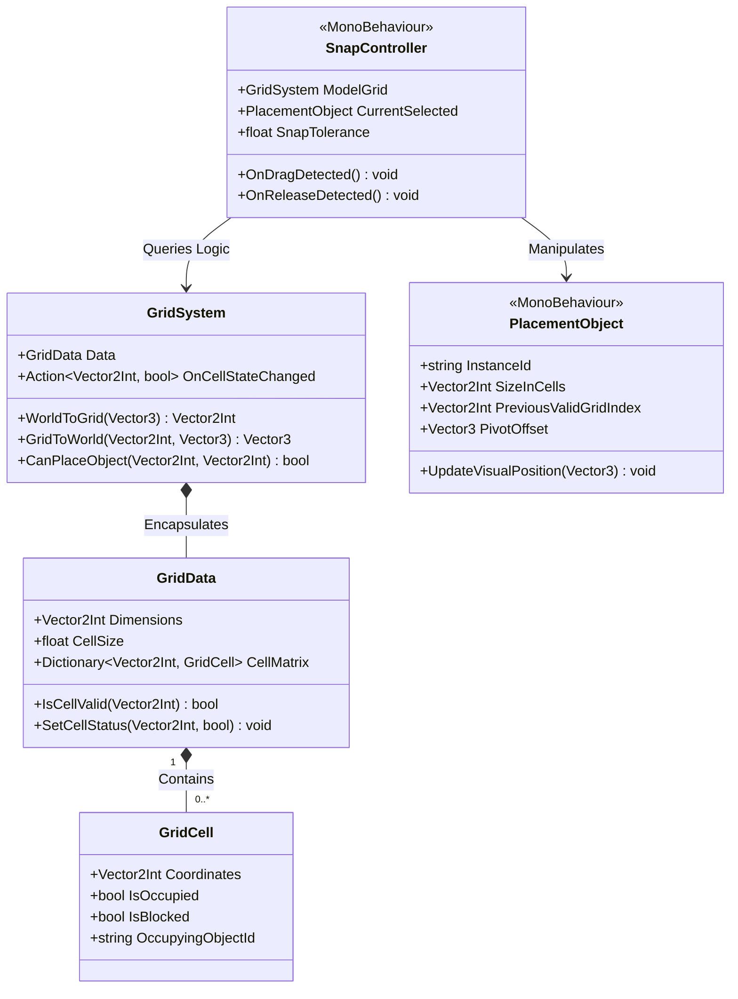
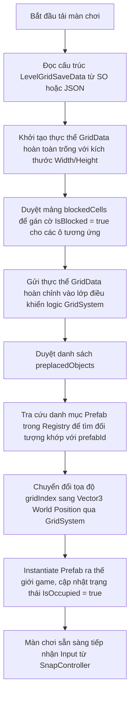
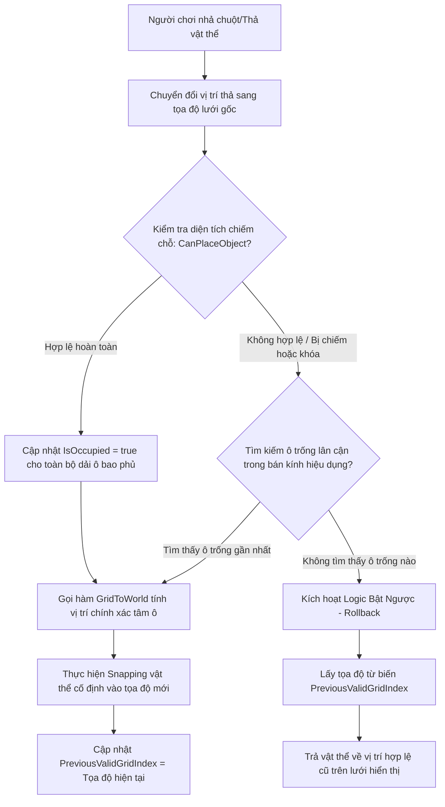

# Tính năng: Hệ Thống Xếp Đặt Vật Thể Trên Lưới (Grid System) và Cơ Chế Snapping

**Vị trí:** Unity Technical Director & Game Architect

**Môi trường phát triển:** Unity Engine (C#)

# 1. Cấu Trúc Class Hướng Đối Tượng Trong Unity (Unity-Based Class Architecture)

Để đảm bảo hệ thống có thể viết được **Unit Test** độc lập mà không cần khởi chạy môi trường đồ họa của Unity, kiến trúc được phân tách nghiêm ngặt thành hai tầng: **Tầng Logic Thuần (Pure C# - Model/Controller)** và **Tầng Hiển Thị/Vật Lý (MonoBehaviour - View/Input)**.



## 1.1. Tầng Logic Thuần (Pure C# - Định hướng Test-Driven)

### `GridCell` (Pure C# Class)

- **Nhiệm vụ:** Đại diện cho dữ liệu nguyên tử của một ô đơn lẻ trên lưới. Không chứa bất kỳ tham chiếu nào đến `GameObject` hay `Transform`.
- **Thuộc tính:**
    - `Coordinates` (`Vector2Int`): Tọa độ định danh vị trí ô $(X, Y)$ trong ma trận lưới.
    - `IsOccupied` (`bool`): Trạng thái ô đang bị chiếm chỗ bởi vật thể nào đó hay không.
    - `IsBlocked` (`bool`): Trạng thái ô bị khóa vĩnh viễn bởi chướng ngại vật của màn chơi.
    - `OccupyingObjectId` (`string`): ID duy nhất của vật thể đang chiếm giữ ô này (rỗng nếu trống).

### `GridData` (Pure C# Class / ScriptableObject Backing Model)

- **Nhiệm vụ:** Lưu trữ toàn bộ ma trận dữ liệu trạng thái của lưới. Lớp này có thể được khởi tạo trực tiếp từ mã nguồn Unit Test.
- **Thuộc tính:**
    - `Dimensions` (`Vector2Int`): Kích thước tổng thể của lưới (Chiều rộng $X$, Chiều cao $Y$).
    - `CellSize` (`float`): Kích thước cạnh của một ô vuông.
    - `CellMatrix` (`Dictionary<Vector2Int, GridCell>`): Bảng tra cứu băm (Hash-map) ánh xạ từ tọa độ $2D$ sang thực thể dữ liệu ô giúp tối ưu hóa thuật toán tìm kiếm thời gian thực.
- **Phương thức:**
    - `IsCellValid(Vector2Int coord)` $\rightarrow$ `bool`: Kiểm tra tọa độ chỉ định có nằm trong phạm vi ma trận và không bị khóa (`IsBlocked`).
    - `SetCellStatus(Vector2Int coord, bool occupied, string objId)` $\rightarrow$ `void`: Cập nhật trạng thái chiếm chỗ cho một ô chỉ định.

### `GridSystem` (Pure C# Logic Controller)

- **Nhiệm vụ:** Bộ não xử lý toán học và logic vận hành hệ thống lưới. Tính toán các thuật toán chuyển đổi không gian và kiểm tra điều kiện xếp đặt.
- **Thuộc tính:**
    - `Data` (`GridData`): Mô hình dữ liệu lưới được đóng gói bên trong.
- **Sự kiện (Events):**
    - `OnCellStateChanged` (`Action<Vector2Int, bool>`): Bắn ra tín hiệu khi có sự thay đổi trạng thái của một ô, giúp tầng hiển thị cập nhật visual (Ví dụ: Đổi màu lưới) mà không bị phụ thuộc luồng (Loose Coupling).
- **Phương thức:**
    - `WorldToGrid(Vector3 worldPos)` $\rightarrow$  `Vector2Int`: Chuyển đổi tọa độ không gian $3D$ thế giới sang chỉ số ô $2D$.
    - `GridToWorld(Vector2Int gridCoord, Vector3 gridOrigin)` $\rightarrow$ `Vector3`: Chuyển đổi ngược từ chỉ số ô sang tọa độ trung tâm hoặc góc của ô đó trong không gian thế giới.
    - `CanPlaceObject(Vector2Int originCoord, Vector2Int objectSize)` $\rightarrow$ `bool`: Kiểm tra xem một vùng không gian lưới tính từ điểm gốc có đủ điều kiện chứa một vật thể có kích thước chỉ định hay không.

## 1.2. Tầng Hiển Thị và Tương Tác Unity (MonoBehaviour Layer)

### `SnapController` (MonoBehaviour)

- **Nhiệm vụ:** Thu thập tương tác đầu vào từ người chơi (Chuột/Cảm ứng), phát hiện sự kiện kéo thả (Drag & Drop) và điều phối trạng thái dính hút (Snapping).
- **Thuộc tính:**
    - `ModelGrid`: Tham chiếu tới thực thể điều khiển logic `GridSystem`.
    - `CurrentSelected` (`PlacementObject`): Vật thể hiện đang được người chơi cầm và kéo đi.
    - `SnapToleranceRadius` (`float`): Bán kính dung sai cho phép kích hoạt hiệu ứng hút.
- **Phương thức:**
    - `OnDragDetected(Vector3 inputWorldPos)` $\rightarrow$ `void`: Cập nhật vị trí tạm thời của vật thể đi theo con trỏ chuột.
    - `OnReleaseDetected()` $\rightarrow$ `void`: Kích hoạt khi người chơi thả chuột, đưa tọa độ về bộ máy kiểm tra occupancies và đưa ra quyết định Snap cố định hoặc Reset vị trí.

### `PlacementObject` (MonoBehaviour)

- **Nhiệm vụ:** Gắn trực tiếp lên các Prefab hiển thị của vật thể, lưu trữ kích thước hình học và tọa độ lịch sử.
- **Thuộc tính:**
    - `InstanceId` (`string`): Chuỗi định danh duy nhất của thực thể vật thể.
    - `SizeInCells` (`Vector2Int`): Kích thước chiếm chỗ trên không gian lưới (Ví dụ: Khối $2 \times 2$ ô).
    - `PreviousValidGridIndex` (`Vector2Int`): Lưu lại tọa độ ô hợp lệ cuối cùng trước khi bị kéo đi để phục vụ logic rollback khi lỗi snap.
    - `PivotOffset` (`Vector3`): Độ lệch điểm neo thiết kế để căn chỉnh chính xác tâm hình học vật thể vào lưới.
- **Phương thức:**
    - `UpdateVisualPosition(Vector3 targetWorldPos)` $\rightarrow$ `void`: Thực hiện di chuyển mượt mà (Lerp/SmoothDamp) phần hình ảnh hiển thị của vật thể tới tọa độ đích.

# 2. Cấu Trúc Dữ Liệu Màn Chơi Data-Driven (ScriptableObject & JSON Integration)

Hệ thống lưu trữ cấu trúc màn chơi tách biệt để dễ dàng chỉnh sửa bởi Game Designer thông qua Unity Inspector (`ScriptableObject`) hoặc lưu/tải động từ bộ nhớ máy, máy chủ (`JSON`).

## 2.1. Template Dữ liệu Mẫu (JSON Cấu hình Màn chơi)

```json
{
  "levelId": "level_grid_puzzle_01",
  "gridSettings": {
    "width": 10,
    "height": 10,
    "cellSize": 1.5
  },
  "blockedCells": [
    { "x": 0, "y": 0 },
    { "x": 0, "y": 1 },
    { "x": 5, "y": 5 }
  ],
  "preplacedObjects": [
    {
      "prefabId": "obj_router_medium",
      "gridIndex": { "x": 2, "y": 3 },
      "rotationDegrees": 90.0
    },
    {
      "prefabId": "obj_switch_8port",
      "gridIndex": { "x": 4, "y": 4 },
      "rotationDegrees": 0.0
    }
  ]
}
```

## 2.2. Kiến Trúc Ánh Xạ và Lớp Trung Gian (Data Mapping Architecture)

Để đồng bộ cấu trúc dữ liệu, chúng ta thiết kế một lớp C# thuần có gắn thuộc tính tuần tự hóa `[Serializable]`. Lớp này hoạt động như một thực thể dữ liệu trung gian (Data Transfer Object):

```csharp
[System.Serializable]
public class LevelGridSaveData
{
    public string levelId;
    public Vector2Int gridDimensions;
    public float cellSize;
    public List<Vector2Int> blockedCells;
    public List<PreplacedObjectData> preplacedObjects;
}

[System.Serializable]
public class PreplacedObjectData
{
    public string prefabId;
    public Vector2Int gridIndex;
    public float rotationDegrees;
}
```

- **Tải qua ScriptableObject:** Designer chỉnh sửa trực tiếp trên file Asset kế thừa từ lớp `ScriptableObject` chứa biến `LevelGridSaveData`.
- **Tải qua JSON:** Gọi `JsonUtility.FromJson<LevelGridSaveData>(jsonString)` để chuyển đổi trực tiếp chuỗi văn bản thành dữ liệu runtime.

## 2.3. Luồng Khởi Tạo Màn Chơi (Initialization Workflow)



# 3. Thuật Toán Snapping & Logic Tọa Độ Lưới (Physics Snapping & Math Logic)

### 3.1. Thuật toán Chuyển Đổi Không Gian Toán Học

Giả định lưới phẳng nằm ngang trên mặt phẳng tương tác $(X, Z)$ của không gian Unity $3D$, với tọa độ gốc của hệ thống lưới nằm tại vị trí thế giới $W_{origin} = (X_o, Y_o, Z_o)$.

### Từ Tọa độ Thế giới sang Chỉ số Lưới (World $\rightarrow$ Grid)

Cho trước vị trí thế giới $W_{pos} = (X_w, Y_w, Z_w)$, ta áp dụng hàm sàn toán học `Mathf.FloorToInt` để ánh xạ chính xác vùng không gian liên tục vào chỉ số ô nguyên:

$$
Grid_X = \lfloor \frac{X_w - X_o}{CellSize} \rfloor
$$

$$
Grid_Y = \lfloor \frac{Z_w - Z_o}{CellSize} \rfloor
$$

Sử dụng `Mathf.FloorToInt` thay vì `Mathf.RoundToInt` giúp đảm bảo vùng biên của ô tính từ cạnh trái sang cạnh phải luôn thuộc về đúng một chỉ số duy nhất, triệt tiêu lỗi nhảy ô (jittering) tại biên.

### Từ Chỉ số Lưới sang Tọa độ Thế giới ($Grid \rightarrow World$)

Để đưa vật thể về nằm chính xác tại **tâm hình học** của ô lưới, đồng thời tích hợp độ lệch điểm neo riêng biệt (`PivotOffset`) của từng Model:

$$
W_{target.x} = Grid_X \times CellSize + (CellSize \times 0.5) + X_o + PivotOffset.x
$$

$$
W_{target.y} = Y_o + PivotOffset.y
$$

$$
W_{target.z} = Grid_Y \times CellSize + (CellSize \times 0.5) + Z_o + PivotOffset.z
$$

## 3.2. Thuật Toán Tìm Kiếm Ô Trống Gần Nhất (Nearest Cell Search Optimization)

Khi người chơi thực hiện thả một vật thể có kích thước lớn tại một vị trí bất kỳ, hệ thống cần quét tìm ô hợp lệ có khoảng cách Euclidean ngắn nhất một cách tối ưu hiệu năng.

1. **Thu hẹp không gian tìm kiếm:** Chuyển đổi tọa độ thả chuột hiện tại sang chỉ số lưới làm gốc $C_{center}$.
2. **Quét vùng theo vòng xoắn (Spiral Search Matrix):** Thay vì quét toàn bộ ma trận lưới lớn gây tốn tài nguyên, thuật toán bắt đầu mở rộng dần từ $C_{center}$ theo các vòng vuông đồng tâm có bán kính từ $r = 0 \rightarrow R_{max}$ (Giới hạn bởi tham số cấu hình hiệu dụng).
3. **Tối ưu phép toán khoảng cách hình học:** * Với mỗi ô $C_{candidate}$ trong vòng quét, chuyển đổi chỉ số của nó sang tọa độ thế giới $W_{candidate}$.
    - Tính toán khoảng cách tới vị trí chuột thả thực tế $W_{mouse}$.
    - **Tiêu chuẩn kỹ thuật:** Tuyệt đối không dùng hàm `Vector3.Distance(A, B)` vì hàm này bắt buộc CPU thực thi phép tính Căn bậc hai ($\sqrt{x}$), gây suy giảm hiệu năng nghiêm trọng khi lặp. Thay vào đó, hệ thống sử dụng bình phương khoảng cách:

$$
\text{sqrMagnitude} = (A.x - B.x)^2 + (A.y - B.y)^2 + (A.z - B.z)^2
$$

```csharp
// Minh họa cấu trúc thuật toán tìm ô gần nhất
float minSqrDistance = float.MaxValue;
Vector2Int bestGridCoord = Vector2Int.one * -1;

// Vòng lặp kiểm tra tập hợp ô ứng viên trong bán kính quét r
foreach (Vector2Int candidateCoord in ScannedSpiralCells)
{
    if (gridSystem.CanPlaceObject(candidateCoord, currentObject.SizeInCells))
    {
        Vector3 worldTarget = gridSystem.GridToWorld(candidateCoord);
        float sqrDist = (worldTarget - currentMouseWorldPos).sqrMagnitude;

        if (sqrDist < minSqrDistance)
        {
            minSqrDistance = sqrDist;
            bestGridCoord = candidateCoord;
        }
    }
}
```

## 3.3. Logic Xử lý Va Chạm và Chiếm Chỗ (Grid Occlusion Handling)



- **Xử lý đa ô (Multi-cell Occlusion):** Khi một vật thể có kích thước lớn hơn $1 \times 1$  (Ví dụ: $2 \times 3$) được đặt xuống, điểm neo gốc (Pivot) nằm ở ô dưới cùng bên trái. Hệ thống sẽ chạy một vòng lặp lồng hai phương trình để quét qua toàn bộ các ô trong dải:
    
    $$
    \text{Dải kiểm tra} = \{ (x, y) \mid Grid_X \le x < Grid_X + Size_X \land Grid_Y \le y < Grid_Y + Size_Y \}
    $$
    
    Nếu có bất kỳ ô nào thuộc tập hợp trên có thuộc tính `IsOccupied == true` hoặc `IsBlocked == true`, toàn bộ khu vực đó được đánh dấu là không hợp lệ.
    

## 3.4. Các Tham Số Cấu Hình Quan Trọng Trong Unity Inspector

Để Game Designer có thể chủ động cân chỉnh trực quan cảm giác điều khiển (Game Feel), lớp `SnapController` cần công khai các tham số sau ra cửa sổ Inspector:

- **`Snap Radius Tolerance` (`float`):** Ngưỡng khoảng cách tối đa (mét). Nếu khoảng cách từ vật thể tới tâm ô lưới nhỏ hơn giá trị này, hiệu ứng hút sẽ tự động giật vật thể vào tâm. Nếu lớn hơn, vật thể vẫn trượt tự do theo chuột.
- **`Grid Line Visual Material` (`Material`):** Chất liệu dựng lưới hiển thị giúp người chơi xác định rõ biên giới các ô.
- **`Invalid Overlay Color` (`Color`):** Mã màu sắc (Ví dụ: Đỏ alpha) áp lên vật thể hiển thị khi người chơi kéo vào vùng ô đã bị chiếm chỗ, cảnh báo không thể thực hiện hành động thả.